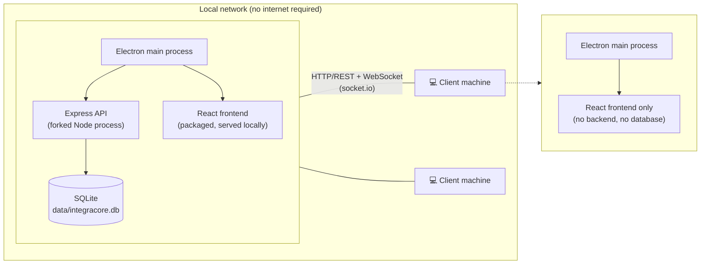

# integraCore

**Local-first inventory & sales management for a single-owner business.**
Runs entirely on a private LAN with no internet dependency — two Windows executables (a **Server** and a **Client** installer), built from one codebase, and ready to move to the cloud later without rewriting the core logic.


---

## Architecture

One React frontend, one Express backend, one database layer — packaged two ways:



- **Server installer** — Electron shell that forks the Express backend, embeds SQLite (`better-sqlite3`, WAL mode) and the built frontend. On first run (empty `users` table) it opens the **Initial Setup screen**: create the first Admin account, or restore an existing `.sqlite` backup.
- **Client installer** — frontend only. It connects to the server machine's LAN IP over HTTP/WebSocket; the IP is set at install time and stays editable in-app (Settings → Connection). No database engine is shipped or needed.
- **Cloud-ready** — the same backend runs on Render with PostgreSQL (Neon), and the same frontend deploys to Vercel. Client code only ever talks HTTP/REST to a configurable backend URL; moving to the cloud changes configuration, not logic.

### Real-time updates

The server pushes critical changes over `socket.io` (JWT-authenticated handshake) so no client ever sells at a stale price:

| Event | Trigger | Client reaction |
|---|---|---|
| `product:updated` | price, stock or discount change (manual or date-triggered) | refetch products & discounts |
| `notification:new` | low-stock / profit-target alerts | refetch notifications |
| `db:restored` | database restored from backup | full cache invalidation (everything may have changed) |

Historical screens (reports, sales history) use simple fetch-on-load — only money-affecting data is pushed.

---

## Features

- **Inventory** — products with SKU/category/price/stock, stock in/out movements, configurable per-product low-stock thresholds, daily low-stock notifications, bulk import from Excel, inventory export. Products are `active` or `discontinued` (never deleted — sales history references them); discontinued products stay visible but stop triggering alerts and can't receive new discounts.
- **Sales** — atomic sale registration (transaction: validate stock → insert → decrement), filterable history (seller, date range, product), Excel export, admin-only deletion with stock restoration.
- **Temporary discounts** — full discount history per product, no overlapping ranges, sale-time price resolution frozen into the sale record (`original_price` + `discount_id`), per-item "was X, sold at Y" UI with a total-savings line, and cancel-vs-delete rules (discounts with sales can only be cancelled, never deleted).
- **Users & roles** — local authentication (bcrypt + JWT), Admin (full access) vs User/seller (own sales only). Every request revalidates the user against the database, so deactivations and role changes apply instantly.
- **Profit target** — configurable monthly target with a daily cron check; shortfalls create in-app notifications.
- **Backup & restore** — one-click `.sqlite` backup (WAL-checkpointed, date-named) and restore with safeguards: explicit warning, auto-backup before swap, schema validation, temporary write lock, and a `db:restored` broadcast afterwards.
- **Excel import/export** — `exceljs`-based, with graceful validation errors (duplicate SKUs, missing fields).
- **i18n** — Spanish (default) and English, switchable in Settings; per-machine currency symbol (default `Bs.`).

---

## Repository layout

npm-workspaces monorepo (Node 22):

| Workspace | What it is |
|---|---|
| `backend/` | Express REST API + socket.io + node-cron jobs. Business logic lives here entirely — Electron and React never touch the database. |
| `frontend/` | React 19 + Vite + Tailwind + shadcn/ui. Used by both Electron installers *and* the Vercel web deployment. |
| `electron/` | Two Electron main processes (`server.ts` forks the backend, `client.ts` connects out) + shared preload. Two electron-builder configs produce the two NSIS installers. |
| `shared/` | Cross-package Zod schemas (all DTOs validated on the backend), entity types, and the single source of truth for date handling (`nowString()`, `todayDateString()` — local wall-clock strings, so lexicographic compare == chronological). |
| `data/` | (Server machine) SQLite file + `data/backups/` for exports and pre-restore auto-backups. |

### Database layer: one codebase, two drivers

Services are written once, in SQLite-flavored SQL, against an async `DatabaseAdapter` interface:

- **`SqliteAdapter`** (default, `DB_DRIVER=sqlite`) — runs `better-sqlite3` natively, normalizes JS booleans to 0/1, transactions via `SAVEPOINT`.
- **`PostgresAdapter`** (`DB_DRIVER=postgresql`) — transparently rewrites queries through a pure, unit-tested transform (`postgres-query-transform.ts`): `datetime('now')` → `NOW()`, `?` → `$1..$N`, `strftime` → `TO_CHAR`, and injects `RETURNING id` so `run().insertId` behaves like SQLite's `lastInsertRowid`.

The adapter layer is the only dialect boundary — switching database changes one env var, not service code.

---

## Getting started

**Prerequisites:** Node.js 22 (`.nvmrc`), npm.

```bash
npm install

# Backend (API on :3001) + frontend (Vite on :5173, /api proxied to :3001)
npm run dev

# Same, plus the Electron shell (server variant in dev mode)
npm run dev:electron
```

Open http://localhost:5173 — on a fresh database the app routes to `/setup` to create the first Admin account.

### Root scripts

| Script | What it does |
|---|---|
| `npm run dev` | Backend (tsx watch) + frontend (Vite) concurrently |
| `npm run dev:electron` | dev + Electron main process |
| `npm run build:api` | shared → backend (tsc) → single CJS bundle (tsup) |
| `npm run build:server-all` / `build:client-all` | full frontend builds per installer variant |
| `npm run dist:server` | build + bundle + **Server `.exe`** → `electron/dist-server/` |
| `npm run dist:client` | build + **Client `.exe`** → `electron/dist-client/` |
| `npm run start` | run the built backend (`node dist/index.cjs`) |

### Building the Windows installers

```bash
npm run dist:server   # Server installer: Electron main + backend bundle + better-sqlite3 + frontend
npm run dist:client   # Client installer: Electron main + frontend only
```

Both are NSIS x64 `.exe` installers produced by electron-builder from `electron-builder-server.yml` / `electron-builder-client.yml`. The installer you run **is** the machine's role — there is no in-app server/client switch. Releases are built and published automatically by GitHub Actions (`.github/workflows/build-release.yml`) on `v*` tags.

### Backend tests

```bash
npm test -w backend          # vitest, ~117 tests
npm run test:coverage -w backend
```

Layout: `backend/test/unit/services` (business logic), `test/unit/cron`, `test/unit/middleware` (auth revalidation), `test/db` (adapters + SQLite→PG query transform + schema migrations), `test/integration` (supertest over the real app). Coverage focuses on `src/services/**`.

---

## Configuration (backend)

| Env var | Default | Notes |
|---|---|---|
| `PORT` | `3001` | API port |
| `DB_DRIVER` | `sqlite` | `sqlite` or `postgresql` |
| `DB_PATH` | `data/integracore.db` | SQLite file location |
| `DATA_DIR` | `./data` | Data root; backups go to `DATA_DIR/backups` |
| `CORS_ORIGIN` | `*` | Comma-separated origins; `*` must stay a plain string (the packaged Electron frontend has `null` origin) |
| `JWT_SECRET` | *(auto)* | If unset, a random 32-byte secret is generated once and persisted to `DATA_DIR/.jwt-secret` (mode 0600) — every install gets its own key, no hardcoded fallback |
| `PG_HOST` / `PG_PORT` / `PG_DATABASE` / `PG_USER` / `PG_PASSWORD` / `PG_SSL` | — | Used when `DB_DRIVER=postgresql` |
| `PG_SSL_REJECT_UNAUTHORIZED` | *(verify in prod)* | TLS certificate verification; defaults to verifying when `NODE_ENV=production`, skipping otherwise |
| `RATE_LIMIT_WINDOW_MINUTES` / `RATE_LIMIT_MAX` | `15` / `20` | Login/setup rate limiting per IP |

---

## Cloud deployment

The LAN architecture lifts to the cloud with configuration only:

- **Frontend → Vercel** (root `vercel.json` / `frontend/vercel.json`): static build, `VITE_BASE=/` for clean URLs, SPA rewrites. Uses `BrowserRouter` on the web (Electron uses `HashRouter` — selected at runtime by `lib/platform.ts`).
- **Backend → Render**: must be a **persistent-process** host — `socket.io` needs long-lived connections, which serverless platforms (e.g. Vercel functions) cannot provide.
- **Database → Neon** (PostgreSQL): set `DB_DRIVER=postgresql` + `PG_*` vars. The setup screen and all gates work identically on both drivers.

---

## Documentation

| Doc | Contents |
|---|---|
| [AGENTS.md](./AGENTS.md) | Canonical product spec — functional requirements, architectural constraints, out-of-scope list |
| [DESIGN.md](./DESIGN.md) | Frontend design system ("Precision Core") — tokens, typography, color semantics, component guidance |
| [MEMORY.md](./MEMORY.md) | Phase-by-phase progress log with decisions, bugfixes and open items |

## Known limitations

- Backup restore performs no cross-version schema migration (explicitly deferred for this MVP; restoring a backup from a different app version is manual/best-effort).
- PostgreSQL TLS verification is on by default in production and off in development (for self-signed instances); override with `PG_SSL_REJECT_UNAUTHORIZED`.
- Credential endpoints are rate-limited (20 attempts / 15 min per IP by default) — sufficient for LAN use; review before any public exposure.
- Electron installer only targets Windows x64; no licensing/activation (deferred by design).
